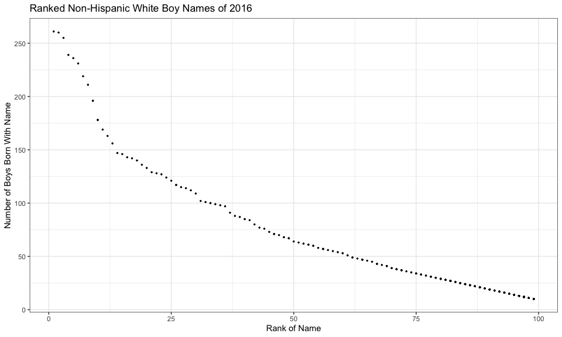

p8105\_hw2\_ah3108
================
Ava Hamilton
9/29/2019

# Problem 1

### Read in and clean Mr. Trash data

``` r
water_df = read_excel(path = "./data_hw2/Trash-Wheel-Collection-Totals-8-6-19.xlsx", sheet = 1, range = "A2:N336") %>% 
  janitor::clean_names() %>% 
  drop_na(dumpster) %>% 
  mutate(sports_balls = as.integer(round(sports_balls, digits = 0)))

head(water_df)
```

    ## # A tibble: 6 x 14
    ##   dumpster month  year date                weight_tons volume_cubic_ya…
    ##      <dbl> <chr> <dbl> <dttm>                    <dbl>            <dbl>
    ## 1        1 May    2014 2014-05-16 00:00:00        4.31               18
    ## 2        2 May    2014 2014-05-16 00:00:00        2.74               13
    ## 3        3 May    2014 2014-05-16 00:00:00        3.45               15
    ## 4        4 May    2014 2014-05-17 00:00:00        3.1                15
    ## 5        5 May    2014 2014-05-17 00:00:00        4.06               18
    ## 6        6 May    2014 2014-05-20 00:00:00        2.71               13
    ## # … with 8 more variables: plastic_bottles <dbl>, polystyrene <dbl>,
    ## #   cigarette_butts <dbl>, glass_bottles <dbl>, grocery_bags <dbl>,
    ## #   chip_bags <dbl>, sports_balls <int>, homes_powered <dbl>

### Read in and clean 2017/2018 precipitation data

``` r
prec18 = read_excel(path = "./data_hw2/HealthyHarborWaterWheelTotals2018-7-28.xlsx", sheet = 3, range = "A2:B9") %>% 
  janitor::clean_names() %>% 
  mutate(year = 2018) %>% 
  view

prec17 = read_excel(path = "./data_hw2/HealthyHarborWaterWheelTotals2018-7-28.xlsx", sheet = 4, range = "A2:B14") %>% 
  janitor::clean_names() %>% 
  mutate(year = 2017) %>% 
  view

precData = bind_rows(prec17, prec18) %>% 
  mutate(month = month.name[month]) %>% 
  rename(inches_rain = total)

head(precData)
```

    ## # A tibble: 6 x 3
    ##   month    inches_rain  year
    ##   <chr>          <dbl> <dbl>
    ## 1 January         2.34  2017
    ## 2 February        1.46  2017
    ## 3 March           3.57  2017
    ## 4 April           3.99  2017
    ## 5 May             5.64  2017
    ## 6 June            1.4   2017

Write stuff here about the water data. Be sure to note the number of
observations in both resulting datasets, and give examples of key
variables. For available data, what was the total precipitation in 2018?
What was the median number of sports balls in a dumpster in
2017.

# Problem 2

### Read in and clean FiveThirtyEight pols-month data

``` r
pols_df = read_csv(file = "./data_hw2/fivethirtyeight_datasets/pols-month.csv") %>% 
  janitor::clean_names() %>% 
  separate(col = mon, into = c("year", "month", "day")) %>%
  mutate(year = as.integer(year),
         month = as.integer(month),
         month = month.name[month],
         president = as.character(prez_dem),
         president = recode(president, "1" = "dem", "0" = "gop")
  ) %>% 
  select(-c("prez_dem", "prez_gop", "day")) 
head(pols_df)
```

    ## # A tibble: 6 x 9
    ##    year month    gov_gop sen_gop rep_gop gov_dem sen_dem rep_dem president
    ##   <int> <chr>      <dbl>   <dbl>   <dbl>   <dbl>   <dbl>   <dbl> <chr>    
    ## 1  1947 January       23      51     253      23      45     198 dem      
    ## 2  1947 February      23      51     253      23      45     198 dem      
    ## 3  1947 March         23      51     253      23      45     198 dem      
    ## 4  1947 April         23      51     253      23      45     198 dem      
    ## 5  1947 May           23      51     253      23      45     198 dem      
    ## 6  1947 June          23      51     253      23      45     198 dem

### Read in and clean FiveThirtyEight snp data

``` r
snp_df = read_csv(file = "./data_hw2/fivethirtyeight_datasets/snp.csv") %>% 
  janitor::clean_names() %>% 
  separate(col = date, int = c("month" ,"day", "year")) %>% 
  mutate(year = as.integer(year),
         month = as.integer(month),
         month = month.name[month]) %>% 
  rename(snp_close = close) %>% 
  arrange(year, month) %>% 
  select(year, month, snp_close)
head(snp_df)
```

    ## # A tibble: 6 x 3
    ##    year month    snp_close
    ##   <int> <chr>        <dbl>
    ## 1  1950 April         18.0
    ## 2  1950 August        18.4
    ## 3  1950 December      20.4
    ## 4  1950 February      17.2
    ## 5  1950 January       17.0
    ## 6  1950 July          17.8

### Read in and clean FiveThirtyEight unemployment data

``` r
unemploy_df = read_csv(file = "./data_hw2/fivethirtyeight_datasets/unemployment.csv")

unemploy_long = pivot_longer(
  unemploy_df,
  Jan:Dec,
  names_to = "month",
  values_to = "unemployment")

unemploy_long =   mutate(
  unemploy_long,
  month = match(month, month.abb),
  month = month.name[month]) %>% 
  rename(year = Year) %>%
  arrange(year, month)

head(unemploy_long)
```

    ## # A tibble: 6 x 3
    ##    year month    unemployment
    ##   <dbl> <chr>           <dbl>
    ## 1  1948 April             3.9
    ## 2  1948 August            3.9
    ## 3  1948 December          4  
    ## 4  1948 February          3.8
    ## 5  1948 January           3.4
    ## 6  1948 July              3.6

### Joining FiveThirtyEight data

``` r
pols_snp = left_join(pols_df, snp_df, by = c("year", "month"))

all_538_df = left_join(pols_snp, unemploy_long, by = c("year", "month"))
head(all_538_df)
```

    ## # A tibble: 6 x 11
    ##    year month gov_gop sen_gop rep_gop gov_dem sen_dem rep_dem president
    ##   <dbl> <chr>   <dbl>   <dbl>   <dbl>   <dbl>   <dbl>   <dbl> <chr>    
    ## 1  1947 Janu…      23      51     253      23      45     198 dem      
    ## 2  1947 Febr…      23      51     253      23      45     198 dem      
    ## 3  1947 March      23      51     253      23      45     198 dem      
    ## 4  1947 April      23      51     253      23      45     198 dem      
    ## 5  1947 May        23      51     253      23      45     198 dem      
    ## 6  1947 June       23      51     253      23      45     198 dem      
    ## # … with 2 more variables: snp_close <dbl>, unemployment <dbl>

Write stuff here about data

# Problem 3

### Read in and clean baby names data

``` r
bn_df = read_csv("./data_hw2/Popular_Baby_Names.csv") %>% 
  janitor::clean_names() %>% 
  mutate(
    gender = as.factor(gender),
    childs_first_name = str_to_upper(childs_first_name),
    childs_first_name = as.factor(childs_first_name),
    ethnicity = as.factor(ethnicity),
    ethnicity = fct_collapse(
      ethnicity,
      ASIAN_PI = c("ASIAN AND PACI", "ASIAN AND PACIFIC ISLANDER"),
      BLACK_NH = c("BLACK NON HISP", "BLACK NON HISPANIC"),
      WHITE_NH = c("WHITE NON HISP", "WHITE NON HISPANIC"),
      HISPANIC = "HISPANIC")
  ) %>% 
  rename(year = year_of_birth) %>% 
 
 distinct() %>% 
  view
```

### Creating Table 3.1: Rank of “Olivia” as a First Name, 2011-2016

``` r
olivia_rank = filter(bn_df, childs_first_name == "OLIVIA") %>%
  select(-c(gender, count, childs_first_name)) %>% 
  arrange(year)

olivia_table  = pivot_wider(olivia_rank,
  names_from = year,
  values_from = rank)

kable(olivia_table,  caption = "Rank of 'Olivia', by Year and Race/Ethnicity", col.names = c("", 2011:2016)) %>%  
  kable_styling(full_width = F) %>%
  column_spec(1, bold = T, border_right = T) 
```

<table class="table" style="width: auto !important; margin-left: auto; margin-right: auto;">

<caption>

Rank of ‘Olivia’, by Year and Race/Ethnicity

</caption>

<thead>

<tr>

<th style="text-align:left;">

</th>

<th style="text-align:right;">

2011

</th>

<th style="text-align:right;">

2012

</th>

<th style="text-align:right;">

2013

</th>

<th style="text-align:right;">

2014

</th>

<th style="text-align:right;">

2015

</th>

<th style="text-align:right;">

2016

</th>

</tr>

</thead>

<tbody>

<tr>

<td style="text-align:left;font-weight: bold;border-right:1px solid;">

ASIAN\_PI

</td>

<td style="text-align:right;">

4

</td>

<td style="text-align:right;">

3

</td>

<td style="text-align:right;">

3

</td>

<td style="text-align:right;">

1

</td>

<td style="text-align:right;">

1

</td>

<td style="text-align:right;">

1

</td>

</tr>

<tr>

<td style="text-align:left;font-weight: bold;border-right:1px solid;">

BLACK\_NH

</td>

<td style="text-align:right;">

10

</td>

<td style="text-align:right;">

8

</td>

<td style="text-align:right;">

6

</td>

<td style="text-align:right;">

8

</td>

<td style="text-align:right;">

4

</td>

<td style="text-align:right;">

8

</td>

</tr>

<tr>

<td style="text-align:left;font-weight: bold;border-right:1px solid;">

HISPANIC

</td>

<td style="text-align:right;">

18

</td>

<td style="text-align:right;">

22

</td>

<td style="text-align:right;">

22

</td>

<td style="text-align:right;">

16

</td>

<td style="text-align:right;">

16

</td>

<td style="text-align:right;">

13

</td>

</tr>

<tr>

<td style="text-align:left;font-weight: bold;border-right:1px solid;">

WHITE\_NH

</td>

<td style="text-align:right;">

2

</td>

<td style="text-align:right;">

4

</td>

<td style="text-align:right;">

1

</td>

<td style="text-align:right;">

1

</td>

<td style="text-align:right;">

1

</td>

<td style="text-align:right;">

1

</td>

</tr>

</tbody>

</table>

### Creating Table 3.2: Top First Boy Name 2011-2016

``` r
boy_one = filter(bn_df, rank == 1 & gender == "MALE") %>% 
  select(-c(gender, count, rank)) %>% 
  arrange(year)

boy_table = pivot_wider(boy_one,
  names_from = year,
  values_from = childs_first_name)


kable(boy_table,  caption = "Top Ranked Boy Name from 2011-2016, by Race/Ethnicity", col.names = c("", 2011:2016)) %>%  
  kable_styling(full_width = F) %>%
  column_spec(1, bold = T, border_right = T) 
```

<table class="table" style="width: auto !important; margin-left: auto; margin-right: auto;">

<caption>

Top Ranked Boy Name from 2011-2016, by
Race/Ethnicity

</caption>

<thead>

<tr>

<th style="text-align:left;">

</th>

<th style="text-align:left;">

2011

</th>

<th style="text-align:left;">

2012

</th>

<th style="text-align:left;">

2013

</th>

<th style="text-align:left;">

2014

</th>

<th style="text-align:left;">

2015

</th>

<th style="text-align:left;">

2016

</th>

</tr>

</thead>

<tbody>

<tr>

<td style="text-align:left;font-weight: bold;border-right:1px solid;">

ASIAN\_PI

</td>

<td style="text-align:left;">

ETHAN

</td>

<td style="text-align:left;">

RYAN

</td>

<td style="text-align:left;">

JAYDEN

</td>

<td style="text-align:left;">

JAYDEN

</td>

<td style="text-align:left;">

JAYDEN

</td>

<td style="text-align:left;">

ETHAN

</td>

</tr>

<tr>

<td style="text-align:left;font-weight: bold;border-right:1px solid;">

BLACK\_NH

</td>

<td style="text-align:left;">

JAYDEN

</td>

<td style="text-align:left;">

JAYDEN

</td>

<td style="text-align:left;">

ETHAN

</td>

<td style="text-align:left;">

ETHAN

</td>

<td style="text-align:left;">

NOAH

</td>

<td style="text-align:left;">

NOAH

</td>

</tr>

<tr>

<td style="text-align:left;font-weight: bold;border-right:1px solid;">

HISPANIC

</td>

<td style="text-align:left;">

JAYDEN

</td>

<td style="text-align:left;">

JAYDEN

</td>

<td style="text-align:left;">

JAYDEN

</td>

<td style="text-align:left;">

LIAM

</td>

<td style="text-align:left;">

LIAM

</td>

<td style="text-align:left;">

LIAM

</td>

</tr>

<tr>

<td style="text-align:left;font-weight: bold;border-right:1px solid;">

WHITE\_NH

</td>

<td style="text-align:left;">

MICHAEL

</td>

<td style="text-align:left;">

JOSEPH

</td>

<td style="text-align:left;">

DAVID

</td>

<td style="text-align:left;">

JOSEPH

</td>

<td style="text-align:left;">

DAVID

</td>

<td style="text-align:left;">

JOSEPH

</td>

</tr>

</tbody>

</table>

### Creating scatterplot of boy names 2016

``` r
wboy_2016 = filter(bn_df, gender == "MALE" & year == 2016 & ethnicity == "WHITE_NH") %>% 
  ggplot(aes(x = rank, y = count)) +
  geom_point()

  wboy_2016
```

<!-- -->
